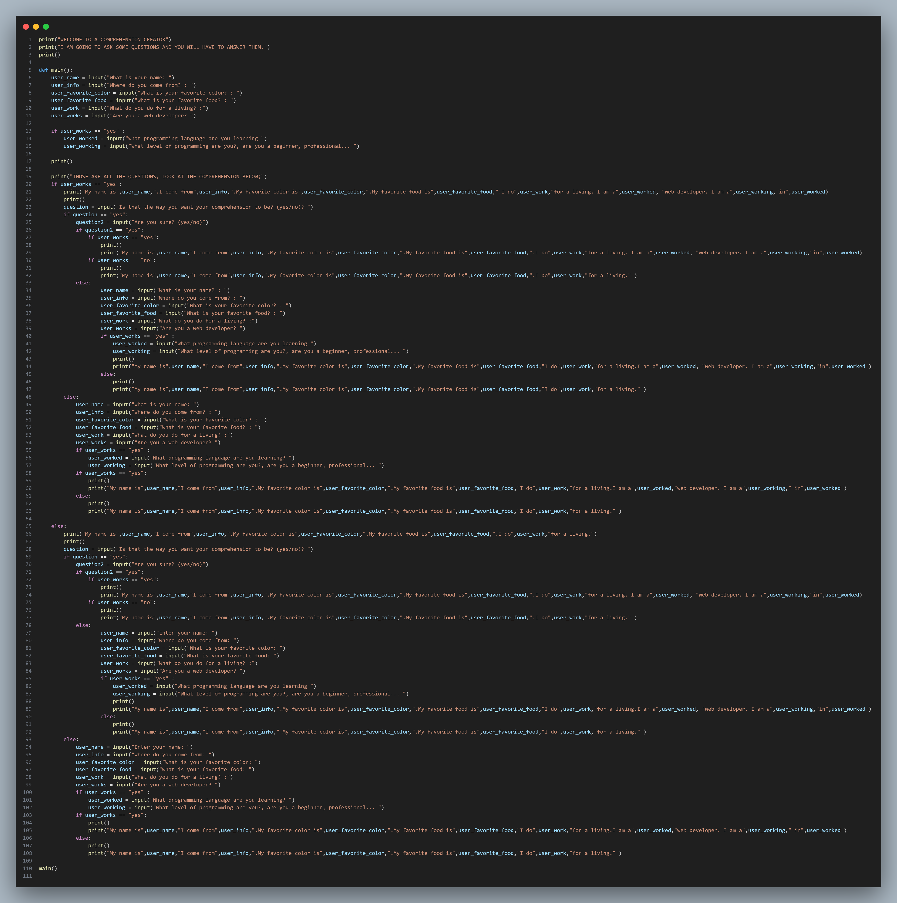

# Comprehension-creator

In order to create a comprehension-creator, you need to follow these steps(there are a lot of codes!(you may not even be able to see them!)):

1. Print a welcoming message(print("WELCOME TO A COMPREHENSION CREATOR")),then print another welcoming message(print("I AM GOING TO ASK SOME QUESTIONS AND YOU WILL HAVE TO ANSWER THEM.")).Create a def() functions(def main():). Create a var(user_name = input("What is your name?: ")),create another var(user_info = input("Where do you come from?: ")),create another var(user_favorite_color = input("What is your favorite color?: ")),create another var(user_favorite_food = input("What is your favorite food?: ")),create another var(user_work = input("What do you do for a living? :")), create another var(user_works = input("Are you a web developer? ")).Create an if statement(if user_works == "yes" :),create a var(user_worked = input("What programming language are you learning ")),create another var(user_working = input("What level of programming are you?, are you a beginner, professional... ")).Print a message like(print("THOSE ARE ALL THE QUESTIONS, LOOK AT THE COMPREHENSION BELOW;")).
2. Create an if statement(if user_works == "yes":), then use the variables created in number 1 to create a comprehension. Create a var(question = input("Is that the way you want your comprehension to be? (yes/no)? ")),then create another if statement which is under the last if statement we made(if question == "yes":) then create a var(question2 = input("Are you sure? (yse/no)")),then create an if statement(if question2 == "yes":) then print out the comprehension but in a way that if the the user says they are a programer(if the user types 'yes'), it will print out a specific comprehension, thats why i created this last if statement(thats the var(user_works)), then create another if statement of if(if user_works == "no":),then print out the comprehension in a way that if the user isn't a programmer, it will print out a specific comprehension(that is in the var(user_works)). Then create an else statement(let the else statement be in the same line of the 2nd if statement we made after print("THOSE ARE ALL THE QUESTIONS, LOOK AT THE COMPREHENSION BELOW;") ) of  else(then print out all the questions we asked the user in the number 1.(don't forget to do the if statement in the question/var 'user_works')).Create an if statement of if(if user_works == "yes":), print the passage according to the question/var(user_works).Then create an else statement then print out the passage(of if the answer to the var/question(user_works)is 'no')
3. Create an else statement(Let the else statement be in the same line of the if statement(The one after(print("THOSE ARE ALL THE QUESTIONS, LOOK AT THE COMPREHENSION BELOW;")) )), then copy everything we did in number number 2. ,then paste if under the else statement.Last but not the least,print out all the hard-work we did by typing(main())

Thats all for todays project, if you don't understand, look at the image below(it's gonna be really hard to look at!!!);
